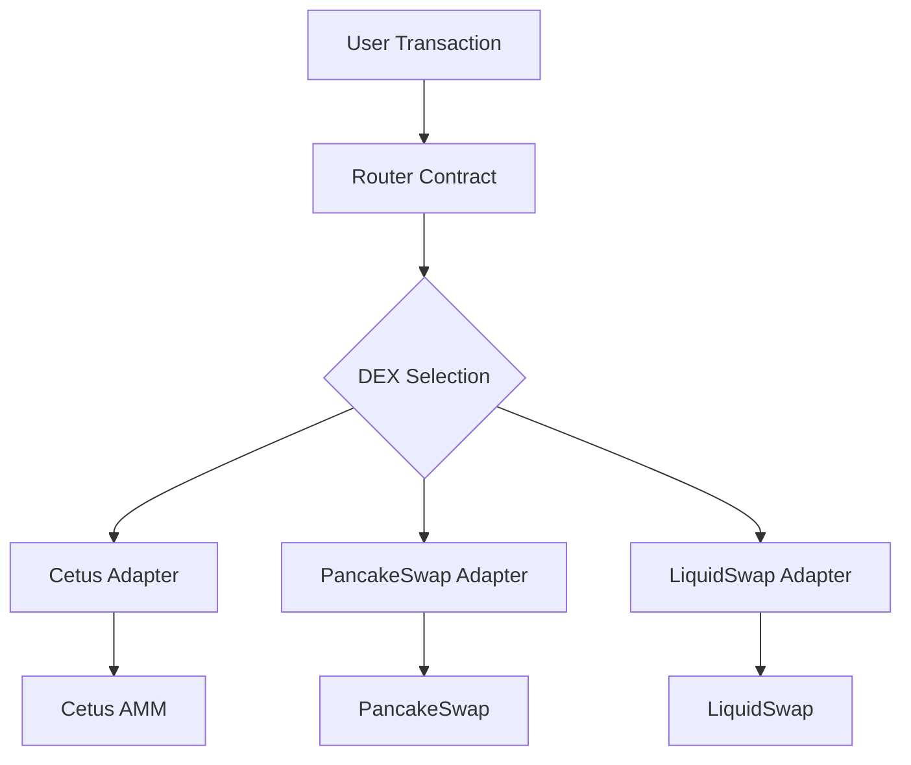
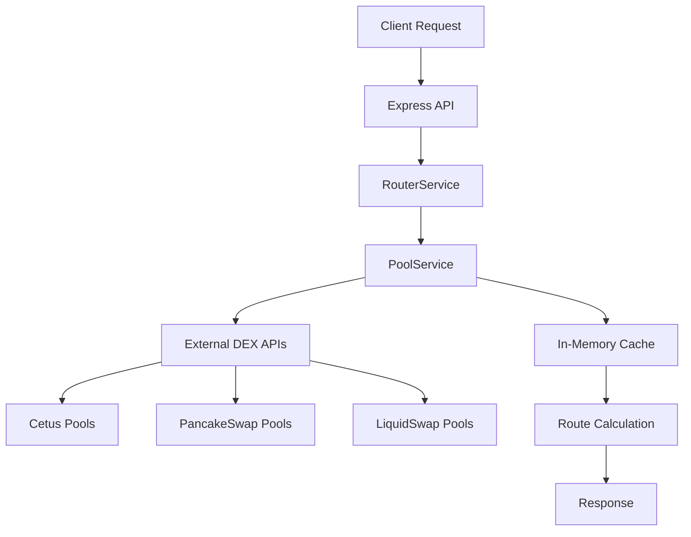

# Cetus Aptos Aggregator

A comprehensive DEX aggregator for the Aptos blockchain that routes trades across multiple decentralized exchanges to find the best prices and minimize slippage. This project includes smart contracts, backend routing service, and TypeScript SDK.

## 🏗️ Project Structure

```
aptos-aggregator/
├── sources/                 # Move smart contracts
│   ├── router.move         # Main aggregator contract
│   ├── cetus_adapter.move  # Cetus AMM integration
│   ├── math.move           # Mathematical utilities
│   └── ...                 # Other DEX adapters
├── backend/                # Routing API service
│   ├── src/
│   │   ├── services/       # Pool and router services
│   │   ├── routes/         # API endpoints
│   │   └── utils/          # Utilities and middleware
│   └── package.json
├── sdk/                    # TypeScript SDK
│   ├── src/
│   │   ├── client.ts       # Main aggregator client
│   │   ├── router.ts       # Route finding logic
│   │   └── types.ts        # Type definitions
│   └── package.json
├── scripts/                # Deployment scripts
└── tests/                  # Move contract tests
```

## ✨ Features

### Smart Contracts
- **Multi-DEX Support**: Integrates with Cetus AMM, PancakeSwap, LiquidSwap, and more
- **Optimal Routing**: Finds the best trading routes across different DEXes
- **Low Slippage**: Minimizes price impact through intelligent routing
- **Gas Optimization**: Efficient transaction batching and routing
- **Fee Management**: Configurable fee structure with admin controls

### Backend Service
- **Real-time Pool Data**: Aggregates liquidity data from multiple DEXes
- **Route Optimization**: Advanced algorithms for finding optimal swap paths
- **High Performance**: Sub-100ms response times for quote requests
- **Multi-hop Support**: Up to 3-hop routes for better prices
- **RESTful API**: Clean API design for easy integration

### TypeScript SDK
- **Easy Integration**: Simple client for interacting with the aggregator
- **Type Safety**: Full TypeScript support with comprehensive types
- **Transaction Building**: Automated transaction construction
- **Error Handling**: Robust error handling and validation

## 🚀 Supported DEXes

- ✅ **Cetus AMM**: Native integration with Cetus AMM on Aptos
- 🚧 **PancakeSwap**: PancakeSwap Aptos integration (in development)
- 🚧 **LiquidSwap**: Pontem Network's LiquidSwap (in development)
- 🚧 **Thala Labs**: Thala's AMM integration (planned)
- 🚧 **AUX Exchange**: AUX protocol integration (planned)

## 🏛️ Architecture

### Smart Contract Layer



**Core Modules:**
- **router.move**: Main aggregator logic and swap routing
- **cetus_adapter.move**: Integration with Cetus AMM
- **math.move**: Mathematical utilities for price calculations
- **utils.move**: General utility functions

### Backend Service Architecture



**Services:**
- **PoolService**: Aggregates pool data from multiple DEXes
- **RouterService**: Finds optimal routes using pathfinding algorithms
- **Express API**: RESTful endpoints for quotes, pools, and health checks

### Data Flow

1. **Pool Data Aggregation**: Backend service fetches pool data from DEXes every 30 seconds
2. **Route Finding**: When a quote is requested, the router finds all possible paths
3. **Optimization**: Routes are ranked by output amount and price impact
4. **Transaction Building**: SDK constructs the optimal transaction for execution

## 🧮 Mathematical Formulas

### Constant Product AMM

For AMMs using the constant product formula (x * y = k):

```
amount_out = (amount_in * reserve_out) / (reserve_in + amount_in)
```

With fees:
```
amount_in_with_fee = amount_in * (1 - fee_rate)
amount_out = (amount_in_with_fee * reserve_out) / (reserve_in + amount_in_with_fee)
```

### Price Impact Calculation

```
spot_price = reserve_out / reserve_in
execution_price = amount_out / amount_in
price_impact = ((spot_price - execution_price) / spot_price) * 100%
```

### Multi-hop Routing

For a 2-hop route A → B → C:
```
amount_b = get_amount_out(amount_a, reserve_a1, reserve_b1, fee1)
amount_c = get_amount_out(amount_b, reserve_b2, reserve_c2, fee2)
total_price_impact = price_impact_1 + price_impact_2
```

## 📊 Performance Metrics

### Backend Performance
- **Quote Response Time**: < 100ms for single-hop routes
- **Multi-hop Processing**: < 500ms for 3-hop routes  
- **Pool Updates**: 30-second refresh cycle
- **Throughput**: 1000+ requests per minute per instance

### Contract Performance
- **Single Swap Gas**: ~5,000 gas units
- **Multi-hop Gas**: ~8,000 gas units per hop
- **Price Impact**: Typically < 1% for standard trades

## 🔧 Configuration

### Contract Configuration

```move
// Initialize aggregator with custom settings
aggregator::router::initialize(
    &admin_signer,
    30,                    // 0.3% fee in basis points
    fee_collector_address  // Fee collection address
);

// Update fee rate (admin only)
aggregator::router::set_fee_rate(&admin_signer, 25); // 0.25%

// Pause/unpause (emergency)
aggregator::router::set_pause_status(&admin_signer, true);
```

### Backend Configuration

```bash
# Core settings
PORT=3000
APTOS_NETWORK=testnet
AGGREGATOR_ADDRESS=0x1

# Performance tuning
POOL_REFRESH_INTERVAL_SECONDS=30
RATE_LIMIT_MAX_REQUESTS=1000

# DEX-specific settings
CETUS_API_URL=https://api.cetus.zone
ENABLE_PANCAKE=true
ENABLE_LIQUIDSWAP=true
```

### SDK Configuration

```typescript
const client = new AptosAggregatorClient(
  AptosNetwork.TESTNET,           // Network
  '0x1',                          // Aggregator address
  'http://localhost:3000/v1',     // Backend API
)

// Update DEX preferences
client.updateDexPreferences({
  excludeDexes: ['PANCAKE'],      // Exclude specific DEXes
  maxHops: 2,                     // Limit route complexity
  slippageTolerance: 100,         // Default slippage (1%)
})
```

## 🏁 Quick Start

### 1. Smart Contract Deployment

```bash
# Navigate to the contract directory
cd aptos-aggregator

# Compile the Move modules
aptos move compile --named-addresses aggregator=<your-address>

# Deploy using the provided script
./scripts/deploy.ps1 -Network testnet -FeeRate 30

# Or deploy manually
aptos move publish --named-addresses aggregator=<your-address>
```

### 2. Backend Service Setup

```bash
# Navigate to backend directory
cd backend

# Install dependencies
npm install

# Copy and configure environment
cp .env.example .env
# Edit .env with your configuration

# Start development server
npm run dev

# Server will be available at http://localhost:3000
```

### 3. SDK Integration

```bash
# Install the SDK
npm install @cetus-protocol/aptos-aggregator-sdk

# Or use it directly
cd sdk
npm install
npm run build
```

**Example Usage:**

```typescript
import { AptosAggregatorClient, AptosNetwork } from '@cetus-protocol/aptos-aggregator-sdk'

// Initialize client
const client = new AptosAggregatorClient(
  AptosNetwork.TESTNET,
  '0x1', // Your deployed aggregator address
  'http://localhost:3000/v1' // Your backend API endpoint
)

// Get a quote
const quote = await client.getQuote({
  coinIn: '0x1::aptos_coin::AptosCoin',
  coinOut: '0xf22bede237a07e121b56d91a491eb7bcdfd1f5907926a9e58338f964a01b17fa::asset::USDC',
  amountIn: '1000000000', // 10 APT (8 decimals)
  slippageTolerance: 50,  // 0.5%
})

// Execute the swap
const account = AptosAggregatorClient.createAccountFromPrivateKey('0x...')
const txHash = await client.executeSwap(account, {
  route: quote.route,
  slippageTolerance: 50,
})

console.log('Transaction hash:', txHash)
```

## 📡 API Reference

### Backend APIs

#### Get Quote
```http
POST /v1/router/quote
Content-Type: application/json

{
  "coin_in": "0x1::aptos_coin::AptosCoin",
  "coin_out": "0xf22bede237a07e121b56d91a491eb7bcdfd1f5907926a9e58338f964a01b17fa::asset::USDC",
  "amount_in": "1000000000",
  "slippage_tolerance": 50,
  "max_hops": 3
}
```

#### Get Pools
```http
GET /v1/pools?dex_type=CETUS&coin_a=0x1::aptos_coin::AptosCoin
```

#### Health Check
```http
GET /v1/health
```

### SDK Methods

```typescript
// Client initialization
const client = new AptosAggregatorClient(network, aggregatorAddress, apiEndpoint)

// Get quote
await client.getQuote(params)

// Execute swap
await client.executeSwap(account, swapParams)

// Simulate swap
await client.simulateSwap(account, swapParams)

// Get balance
await client.getBalance(address, coinType)

// Register coin
await client.registerCoinIfNeeded(account, coinType)
```

## Configuration

### Fee Structure

- Fees are denominated in basis points (1 bp = 0.01%)
- Default fee: 30 bp (0.3%)
- Fees are collected by the designated fee collector address

### Admin Functions

- `set_fee_rate`: Update the aggregator fee rate
- `set_pause_status`: Pause/unpause the aggregator
- `update_fee_collector`: Change the fee collection address

## Integration Guide

### Adding New DEX Adapters

1. Create a new adapter module (e.g., `new_dex_adapter.move`)
2. Implement the required swap functions
3. Add the DEX identifier to the router module
4. Update the router's swap logic to include the new DEX

### Example Adapter Structure

```move
module aggregator::new_dex_adapter {
    use aptos_framework::coin::{Self, Coin};
    
    public fun swap<CoinIn, CoinOut>(
        user: &signer,
        coin_in: Coin<CoinIn>,
        min_amount_out: u64,
    ): Coin<CoinOut> {
        // DEX-specific swap logic
    }
    
    #[view]
    public fun get_quote<CoinIn, CoinOut>(amount_in: u64): u64 {
        // Price quote logic
    }
}
```

## Mathematical Formulas

### Constant Product AMM

For AMMs using the constant product formula (x * y = k):

```
amount_out = (amount_in * reserve_out) / (reserve_in + amount_in)
```

### Price Impact Calculation

```
price_impact = ((spot_price - execution_price) / spot_price) * 100%
```

### Slippage Protection

```
min_amount_out = expected_amount * (1 - slippage_tolerance)
```

## Testing

Run the test suite:

```bash
aptos move test
```

### Test Coverage

- ✅ Mathematical calculations
- ✅ Fee calculations
- ✅ Slippage calculations
- 🚧 Integration tests with actual DEXes
- 🚧 Multi-hop routing tests

## Security Considerations

1. **Slippage Protection**: Always set appropriate minimum output amounts
2. **Access Controls**: Admin functions are properly protected
3. **Integer Overflow**: Math operations include overflow protection
4. **Pause Mechanism**: Emergency pause functionality for security incidents

## Roadmap

- [ ] Complete Cetus AMM integration
- [ ] Add PancakeSwap support
- [ ] Implement LiquidSwap integration
- [ ] Add Thala Labs support
- [ ] Multi-hop routing optimization
- [ ] Flash loan arbitrage capabilities
- [ ] Advanced routing algorithms
- [ ] SDK development for easy integration

## Contributing

1. Fork the repository
2. Create a feature branch
3. Implement your changes with tests
4. Submit a pull request

## License

[MIT License](LICENSE)

## Contact

- Website: [cetus.zone](https://cetus.zone)
- Twitter: [@CetusProtocol](https://twitter.com/CetusProtocol)
- Discord: [Cetus Community](https://discord.gg/cetus)

---

**Disclaimer**: This is experimental software. Use at your own risk. Always test thoroughly on testnet before mainnet deployment.
